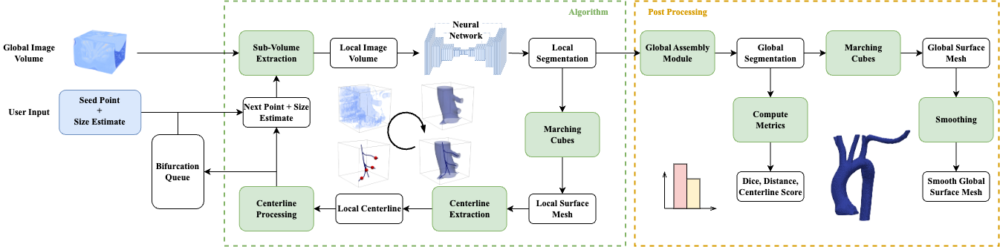
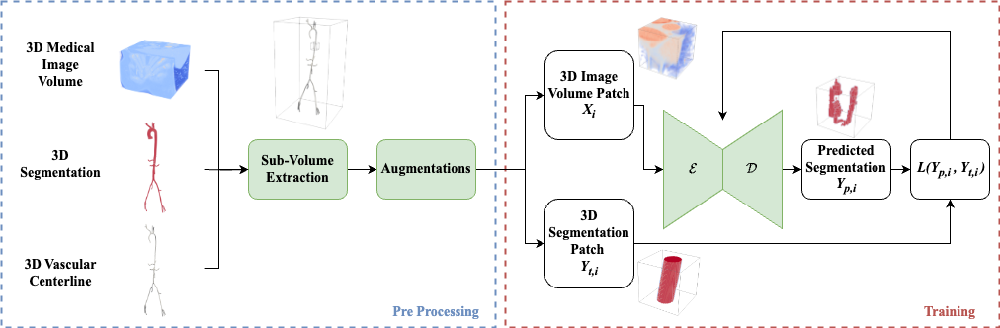

# SeqSeg: Automatic Tracking and Segmentation of Blood Vessels in CT and MR Images

See paper [here](https://rdcu.be/dU0wy) for detailed explanations and citation.

Below is an example showing the algorithm tracking and segmenting an abdominal aorta in 3D MR image scan:


## Tutorial
[Here](https://github.com/numisveinsson/SeqSeg/blob/main/seqseg/tutorial/tutorial.md) is a tutorial on how to run the code, including installation instructions, downloading model weights, and running the segmentation pipeline on a medical image.

## How it works
SeqSeg is a method for automatic tracking and segmentation of blood vessels in medical images. The algorithm uses a neural network to segment the vasculature locally and uses a tracking algorithm to take steps along the direction of the vessel and down bifurcation detected.

Here is the workflow of the algorithm:



where the neural network was trained on local subvolume patches of the image:



## Set Up
If you are familiar with python, you can simply install SeqSeg using pip:
```bash
pip install seqseg
```
Check to see if the installation was successful by running:
```bash
seqseg --help
```

Example setup using conda:
```bash
conda create -n seqseg python=3.11
conda activate seqseg
pip install seqseg

```
Example setup using pip (first create a virtual environment, see [here](https://packaging.python.org/en/latest/guides/installing-using-pip-and-virtual-environments/)):
```bash
python3 -m venv seqseg
source seqseg/bin/activate
pip install seqseg
```

SeqSeg relies on [nnU-Net](https://github.com/MIC-DKFZ/nnUNet) for segmentation of the local medical image volumes. You will need model weights to run the algorithm - either use pretrained weights (available) or train a model yourself. After training a nnU-Net model, the weights will be saved in a `nnUNet_results` folder. This folder is required to run SeqSeg, and its path is set as an argument when running the script.

Main package dependencies:

Basic:
- Python 3.11

Machine Learning (Note: must be installed according to nnU-Net instructions):
- nnU-Net, nnunetv2=2.5.1
- Pytorch, torch=2.3.1

Image and Data Processing:
- SITK, simpleitk=2.2.1
- VTK, vtk=9.1.0
- PyYaml, pyyaml=6.0.1
- Matplotlib (optional)
- Pyyaml (optional)

and if using VMTK (not required):
- VMTK

Note: The code is tested with Python 3.11 and nnU-Net 2.5.1. If you are using a different version, please check the compatibility of the packages.

## Running

See [here](https://github.com/numisveinsson/SeqSeg/blob/main/seqseg/tutorial/tutorial.md) for tutorial on how to run the code.

### Set up data directory
Create a directory structure for your data as follows:

1. Images: Directory containing the medical images to be segmented. Image extension can be `.nii.gz`, `.mha`, `.nrrd`, or any of [these](https://simpleitk.readthedocs.io/en/master/IO.html).
2. Seeds: A `seeds.json` file containing the seed points for initialization.
3. Centerlines (optional): Directory containing centerline files if available.
4. Truths (optional): Directory containing ground truth segmentations if available.
seqseg/tutorial/data/
    ├── images
    ├── seeds.json
    ├── centerlines (if applicable)

SeqSeg requires a seed point for initialization. This can be given by either:
- `seeds.json` file: located in data directory (see sample under data)
- centerline: if centerlines are given, we initialize using the first points of the centerline
- cardiac mesh: then the aortic valve must be labeled as Region 8 and LV 7

### Activate environment (eg. conda)
```bash
conda activate seqseg
```
or if using virtual environment:
```bash
source seqseg/bin/activate
```

### Run
```bash
seqseg \
    -data_dir seqseg/tutorial/data/ \
    -nnunet_results_path nnUNet_results/ \
    -test_name 3d_fullres \
    -train_dataset Dataset005_SEQAORTANDFEMOMR \
    -fold 0 \
    -img_ext .mha \
    -config_name aorta_tutorial \
    -max_n_steps 5 \
    -max_n_branches 2 \
    -outdir output/ \
    -unit cm \
    -scale 1 \
    -start 0 \
    -stop -1
```

Note on units: typically the images used for training and tesing have the same units (e.g. mm or cm). If the units are different, you can set the `scale` argument to convert between the two. Here are the two examples where the units are different:
- If the nnUNet model was trained on mm and the testing data is in cm, then set `scale=10`.
- If the nnUNet model was trained on cm and the testing data is in mm, then set `scale=0.1`.

### Details

`seqseg`: Main script to run.

Arguments:

-`data_dir`: This argument specifies the name of the folder containing the testing data (and test.json if applicable).

-`test_name`: This argument specifies the name of the nnUNet test to use. The default value is '3d_fullres'. Other possible values could be '2d', etc.

-`train_dataset`: This argument specifies the name of the dataset used to train the nnUNet model. For example, 'Dataset010_SEQCOROASOCACT'.

-'config_name': This argument specifies the name of the config file to use. The default value is 'global.yml'.

-`fold`: This argument specifies which fold to use for the nnUNet model. The default value is 'all'.

-`img_ext`: This argument specifies the image extension. For example, '.nii.gz'.

-`outdir`: This argument specifies the output directory where the results will be saved.

-`scale`: This argument specifies whether to scale image data. This is needed if the units for the nnUNet model and testing data are different. Example: if the nnUNet model was trained on mm and the testing data is in cm, then set scale=10. The default value is 1.

-`start`: This argument specifies where to start in the list of testing samples. The default value is 0.

-`stop`: This argument specifies where to stop in the list of testing samples. The default value is -1, which means to process all samples until the end of the list.

-`max_n_steps`: This argument specifies the maximum number of steps to run the algorithm. The default value is 1000.

-`unit`: This argument specifies the unit of the image data. The default value is 'cm'.

## Config file
`config/xx.yml`: File contains config parameters, default is set but can be changed depending on task

We recommend duplicating the file and changing the name to avoid overwriting the default values.
If so, the config file must be passed as an argument when running the script: `config_name`

## Citation
When using SeqSeg, please cite the following [paper](https://rdcu.be/dU0wy):
    
```
@Article{SveinssonCepero2024,
author={Sveinsson Cepero, Numi
and Shadden, Shawn C.},
title={SeqSeg: Learning Local Segments for Automatic Vascular Model Construction},
journal={Annals of Biomedical Engineering},
year={2024},
month={Sep},
day={18},
issn={1573-9686},
doi={10.1007/s10439-024-03611-z},
url={https://doi.org/10.1007/s10439-024-03611-z},
}
```
